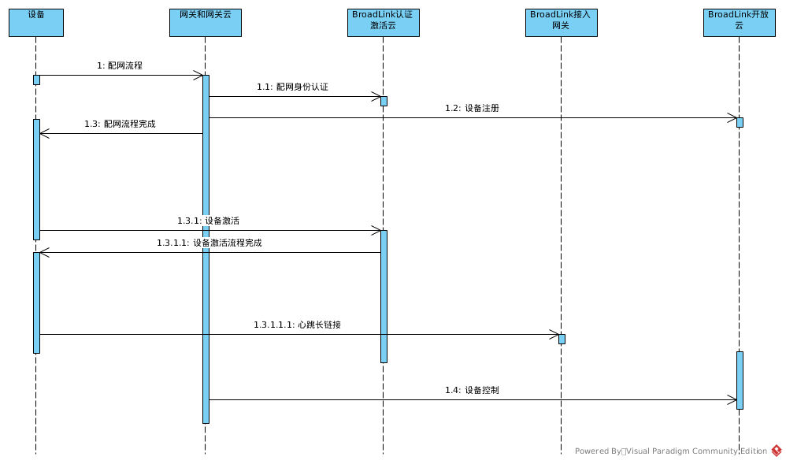

## 云端接口参考
<span style="color:#ccc">2</span> 云端接口

整体流程:



<span style="color:#ccc">2.1</span> 云端身份校验接口
```
POST https://(OpenproxyURL)/openproxy/v2/identity?license=(license)

请求：
{
    "directive": {
        "header": {
            "namespace": "DNA.CloudIdentity",
            "name": "Identity",
            "interfaceVersion": "2",
            "messageId": "1bd5d003-31b9-476f-ad03-71d471922820"
        },
        "payload": {
            "device": {
                "deviceId":""
                "deviceInfo":"xxxxx"//设备信息透传字段
                "challenge":""
            }
        }
    }
}

响应：
{
    "context": {},
    "event": {
        "header": {
            "namespace": "DNA.CloudIdentity",
            "name": "Response",
            "interfaceVersion": "2",
            "messageId": "5f8a426e-01e4-4cc9-8b79-65f8bd0fd8a4"
        },
        "payload": {
          "device": {
              "deviceId":"",
              "deviceInfo":"xxxxx",
              "challenge":"",
              "signature":""
          }
        }
      }
}

其中challenge为设备和激活云端生成的加密签名，只有设备可以解析。
```

<span style="color:#ccc">2.2</span> 设备身份声明接口
```
POST https://(OpenproxyURL)/openproxy/v2/identity?license=(license)

请求：
{
    "directive": {
        "header": {
            "namespace": "DNA.DeviceIdentity",
            "name": "Identity",
            "interfaceVersion": "2",
            "messageId": "1bd5d003-31b9-476f-ad03-71d471922820"
        },
        "payload": {
            "device": {
                "deviceId":""
                "deviceInfo":"xxxxx",
                "signature":""
            }
        }
    }
}

响应：
{
    "context": {},
    "event": {
        "header": {
            "namespace": "DNA.DeviceIdentity",
            "name": "Response",
            "interfaceVersion": "2",
            "messageId": "5f8a426e-01e4-4cc9-8b79-65f8bd0fd8a4"
        },
        "payload": {
          "device": {
              "deviceId":"",
              "deviceInfo":"xxxx",
              "shareKey":""
          }
        }
      }
}
```

<span style="color:#ccc">2.3</span> 设备注册接口
```
POST https://(OpenproxyURL)//openproxy/v2/openregister?license=(license)

请求：
{
    "directive": {
        "header": {
            "namespace": "DNA.Register",
            "name": "Register",
            "interfaceVersion": "2",
            "messageId": "1bd5d003-31b9-476f-ad03-71d471922820"
        },
        "payload": {
            "device": {
                deviceId:"xxx",
                deviceInfo:"xxx",
                tokenInfo:"xxx",//设备配网生成的token
                cookie:{
                    "subDeviceInfo":subDeviceInfo //虚拟面板设备携带，其他设备不传，结构见透传字段
                }//设备额外信息，如面板、子设备信息,一般是h5或者sdk返回。
                     
            }
        }
    }
}

响应：
{
    "context": {},
    "event": {
        "header": {
            "namespace": "DNA.Register",
            "name": "Response",
            "interfaceVersion": "2",
            "messageId": "5f8a426e-01e4-4cc9-8b79-65f8bd0fd8a4"
        },
        "endpoints": [
            {
                "endpointId": "appliance-001"，//设备的,一般为sdk设备发现的did
                "friendlyName": "卧室灯",//设备的默认名称
                "description": "由BroadLink生产的灯",
                "manufacturerName": "Sample Manufacturer",
                "icon":"产品图片URL",
                "brand":"品牌",
                "displayCategories": [
                    "LIGHT"
                ],
                "cookie": {
                    "extraDetail1": "某些设备可能会用到这个cookie，需要在控制时原样返回",
                    "extraDetail2": "某些设备可能会用到这个cookie，需要在控制时原样返回",
                    "extraDetail3": "某些设备可能会用到这个cookie，需要在控制时原样返回",
                    "extraDetail4": "某些设备可能会用到这个cookie，需要在控制时原样返回"
                },
                "capabilities": [
                    {
                        "type": "DNAInterface",
                        "interface": "DNA.PowerControl",
                        "version": "2",
                        "properties": {
                            "supported": [
                                {
                                    "name": "powerState"
                                }
                            ],
                            "proactivelyReported": true,
                            "retrievable": true
                        },
                       "actions": {
                           "supported": [
                            {
                                 "name": "ChangePowerState"
                            }
                           ]
                       }
                    }
                ]
            }
        ]
    }
}

```
<span style="color:#ccc">2.4</span> 设备控制接口
```
POST https://(OpenproxyURL)/openproxy/v2/opencontrol?license=(license)
请求：
{
  "directive": {
    "header": {
       "namespace": "DNA.PowerControl",//控制能力
       "name": "ChangePowerState",//控制动作
       "interfaceVersion": "2",//目前版本标识
       "messageId": "1bd5d003-31b9-476f-ad03-71d471922820"//请求id,返回信息中会保持一致。
    },
    "endpoint": {
      "endpointId": "Some-Device-ID",//注册返回
      "cookie": {}//注册返回的cookie,第三方云端透传
    },
    "payload": {
        "powerState":"OFF"//控制属性和属性值
    }
  }
}
响应：
{
  "context": {//控制参数
    "properties": [ {
       "namespace": "DNA.PowerControl",
       "name": "powerState",
       "value": “ON”,
       "timeOfSample": "2017-02-03T16:20:50.52Z",
    } ]
  },
  "event": {
    "header": {
       "namespace": "DNA.PowerControl",
       "name": "Response",//成功返回标识
       "interfaceVersion": "2",
       "messageId": "5f8a426e-01e4-4cc9-8b79-65f8bd0fd8a4",
    },
    "endpoint": {
      "endpointId": "appliance-001"//控制设备
    },
    "payload": {
    }
  }
}
```

<span style="color:#ccc">2.5</span> 设备在线状态查询接口

每次最多查询32个设备的在线状态（暂无使用）
```
POST https://(OpenproxyURL)/openproxy/v2/querystate?license=(license)
请求：
{
  "directive": {
    "header": {
       "namespace": "DNA.QueryState",
       "name": "QueryState",
       "interfaceVersion": "2",
       "messageId": "1bd5d003-31b9-476f-ad03-71d471922820"
    },
    "endpoints": [{
      "endpointId": "Some-Device-ID",
      "cookie": {}
    }],
    "payload": {
    }
  }
}
响应：
{
  "context": {
    "properties": []
  },
  "event": {
    "header": {
       "namespace": "DNA.QueryState",
       "name": "Response",
       "interfaceVersion": "2",
       "messageId": "5f8a426e-01e4-4cc9-8b79-65f8bd0fd8a4",
    },
    "endpoints": [{
      "endpointId": "appliance-001",
      "state": "online"
    }],
    "payload": {
    }
  }
}
```

<span style="color:#ccc">2.6</span> 设备状态查询接口
```
POST https://(OpenproxyURL)/openproxy/v2/opencontrol?license=(license)
请求：
{
  "directive": {
    "header": {
       "namespace": "DNA",
       "name": "ReportState",
       "interfaceVersion": "2",
       "messageId": "1bd5d003-31b9-476f-ad03-71d471922820"
    },
    "endpoint": {
      "endpointId": "Some-Device-ID",
      "cookie": {}
    },
    "payload": {
    }
  }
}
响应：
{
  "context": {
"properties": [
        {
           "namespace": "DNA",
           "name": "powerState",
           "value":{
                "value":"ON",
                "scale":"",
                "attributeName":"开关"
                "scaleName":"",
                "valueName":"打开"
           },
           "timeOfSample": "2017-02-03T16:20:50.52Z",
        }
    ]

  },
  "event": {
    "header": {
       "namespace": "DNA.QueryState",
       "name": "Response",
       "interfaceVersion": "2",
       "messageId": "5f8a426e-01e4-4cc9-8b79-65f8bd0fd8a4",
    },
    "endpoint": {
      "endpointId": "appliance-001",
    },
    "payload": {
    }
  }
}
```

<span style="color:#ccc">2.6</span> 透传红码控制接口
```
POST https://(OpenproxyURL)/openproxy/v2/opencontrol?license=(license)
请求：
{
  "directive": {
    "header": {
       "namespace": "DNA.FreeControl",
       "name": "DnaCodeControl",
       "interfaceVersion": "2",
       "messageId": "1bd5d003-31b9-476f-ad03-71d471922820"
    },
    "endpoint": {
      "endpointId": "Some-Device-ID",
      "cookie": {}
    },
    "payload": {
        "dnaCode":"b445sdfafad112224sdf"
    }
  }
}
响应：
{
  "context": {//控制参数
    "properties": [ {
       "namespace": "DNA.FreeControl",
       "name": "DnaCodeControl",
       "value": "b445sdfafad112224sdf",//控制指令
       "timeOfSample": "2017-02-03T16:20:50.52Z",
    } ]
  },
  "event": {
    "header": {
       "namespace": "DNA.FreeControl",
       "name": "Response",//成功返回标识
       "interfaceVersion": "2",
       "messageId": "5f8a426e-01e4-4cc9-8b79-65f8bd0fd8a4",
    },
    "endpoint": {
      "endpointId": "appliance-001"//控制设备
      cookie:{}
    },
    "payload": {
    }
  }
}

```


<span style="color:#ccc">2.7</span> 设备管理相关

<span style="color:#ccc">2.7.1</span> OTA查询版本接口
```
POST https://(OpenproxyURL)/openproxy/v2/control?license=(license)
请求：
{
  "directive": {
    "header": {
       "namespace": "DNA.ManagerControl",
       "name": "QueryVersion",
       "interfaceVersion": "2",
       "messageId": "1bd5d003-31b9-476f-ad03-71d471922820"
    },
    "endpoint": {
      "endpointId": "Some-Device-ID",
      "cookie": {}
    },
    "payload": {
    }
  }
}
响应：
{
  "context": {
    
  },
  "event": {
    "header": {
       "namespace": "DNA.ManagerControl",
       "name": "Response",//成功返回标识
       "interfaceVersion": "2",
       "messageId": "5f8a426e-01e4-4cc9-8b79-65f8bd0fd8a4",
    },
    "endpoint": {
      "scope": {
      },
      "endpointId": "appliance-001"//控制设备
    },
    "payload": {
	     "version":"xxxxxx"//查询返回数据
    }
  }
}
```


<span style="color:#ccc">2.7.2</span> OTA版本升级
```
POST https://(OpenproxyURL)/openproxy/v2/control?license=(license)
请求：
{
  "directive": {
    "header": {
       "namespace": "DNA.ManagerControl",
       "name": "OTAUpgrade",
       "interfaceVersion": "2",
       "messageId": "1bd5d003-31b9-476f-ad03-71d471922820"
    },
    "endpoint": {
      "endpointId": "Some-Device-ID",
      "cookie": {}
    },
    "payload": {
        "url":"xxxx"
    }
  }
}
响应：
{
  "context": {//控制参数
    "properties": [ {
       "namespace": "DNA.ManagerControl",
       "name": "OTAUpgrade",
       "value": "b445sdfafad112224sdf",//控制指令
       "timeOfSample": "2017-02-03T16:20:50.52Z",
    } ]
  },
  "event": {
    "header": {
       "namespace": "DNA.ManagerControl",
       "name": "Response",//成功返回标识
       "interfaceVersion": "2",
       "messageId": "5f8a426e-01e4-4cc9-8b79-65f8bd0fd8a4",
    },
    "endpoint": {
      "endpointId": "appliance-001"//控制设备
    }
    "payload": {
	    
    }
  }
}
```

<span style="color:#ccc">2.7.3</span> 远程复位接口
```
POST https://(OpenproxyURL)/openproxy/v2/control?license=(license)
请求：
{
  "directive": {
    "header": {
       "namespace": "DNA.ManagerControl",
       "name": "Reset",
       "interfaceVersion": "2",
       "messageId": "1bd5d003-31b9-476f-ad03-71d471922820"
    },
    "endpoint": {
      "endpointId": "Some-Device-ID",
      "cookie": {}
    },
    "payload": {
    }
  }
}
响应：
{
  "context": {
    
  },
  "event": {
    "header": {
       "namespace": "DNA.ManagerControl",
       "name": "Response",//成功返回标识
       "interfaceVersion": "2",
       "messageId": "5f8a426e-01e4-4cc9-8b79-65f8bd0fd8a4",
    },
    "endpoint": {
      "endpointId": "appliance-001"//控制设备
    },
    "payload": {
	     "version":"xxxxxx"//查询返回数据
    }
  }
}
```

<span style="color:#ccc">2.8</span> 数据上报结构
```
POST https://YOURURL
上报结构：
{
    "context":{

    },
    "event":{
        "header":{
            "namespace":"DNA",
            "name":"ChangeReport",
            "payloadVersion":"3",
            "messageId":"yfwf-pnpu4uc5ax7xcxia"
        },
        "endpoint":{
            "deviceId":""
        },
        "payload":{
            "change":{
                "cause":{
                    "type":"PHYSICAL_INTERACTION"
                },
                "properties":[
                    {
                        "namespace":"DNA.EndpointHealth",
                        "name":"connectivity",
                        "value":{
                            "value":"OK" or "UNREACHABLE"
                        },
                        "timeOfSample":"2018-05-14T23:24:04.52Z",
                        "uncertaintyInMilliseconds":0
                    }
                ]
            }
        }
    }
}
```
<span style="color:#ccc">2.9</span> 红码学习相关接口

<span style="color:#ccc">2.9.1</span> RM进入学习功能接口
```
POST https://(OpenproxyURL)/openproxy/v2/learncode?license=(license)
请求：
{
  "directive": {
    "header": {
       "namespace": "DNA.RMControl",
       "name": "StudyIrCode",
       "interfaceVersion": "2",
       "messageId": "1bd5d003-31b9-476f-ad03-71d471922820"
    },
    "endpoint": {
      "endpointId": "Some-Device-ID",
      "cookie": {}
    },
    "payload": {
    }
  }
}
响应：
{
  "context": {
  },
  "event": {
    "header": {
       "namespace": "DNA.RMControl",
       "name": "Response",//成功返回标识
       "interfaceVersion": "2",
       "messageId": "5f8a426e-01e4-4cc9-8b79-65f8bd0fd8a4",
    },
    "endpoint": {
      "endpointId": "appliance-001"//控制设备
    },
    "payload": {
    }
  }
}
```

<span style="color:#ccc">2.9.2</span> RM查询红码学习结果

```
POST https://(OpenproxyURL)/openproxy/v2/learncode?license=(license)
请求：
{
  "directive": {
    "header": {
       "namespace": "DNA.RMControl",
       "name": "GetIrCode",
       "interfaceVersion": "2",
       "messageId": "1bd5d003-31b9-476f-ad03-71d471922820"
    },
    "endpoint": {
      "endpointId": "Some-Device-ID",
      "cookie": {}
    },
    "payload": {
    }
  }
}

响应：
{
    "context":{
    },
    "event":{
        "header":{
            "namespace":"DNA.RMControl",
            "messageId":"30d2cd1a-ce4f-4542-aa5e-04bd0a6492d5",//新生成
            "name":"GetIrCode",
            "interfaceVersion":"2"
        },
        "endpoint":{
            "endpointId":"appliance-001"
        },
        "payload":{
            "code":"2600ac000700059e0001158911121211"
        }
    }
}
```

<span style="color:#ccc">2.10</span> 接口错误响应

<span style="color:#ccc">2.10.1</span> 错误响应格式

```
返回消息中
    event.name="ErrorResponse",
    payload中是具体错误类型和原因。
举例：
{
  "context": {},
  "event": {
      "header": {
      "namespace": "DNA.PowerControl",
      "messageId": "30d2cd1a-ce4f-4542-aa5e-04bd0a6492d5",
      "name": "ErrorResponse",
      "payloadVersion": "2"
    },
    "endpoint": {
      "scope": {
        "type": "BearerToken",
        "token": "some-access-token"
      },
      "endpointId": "appliance-001"
    },
    "payload": {
        "type": "ENDPOINT_UNREACHABLE",
        "message":"xxx",
    }
  }
```

<span style="color:#ccc">2.10.2</span> 错误码表

|字段 | 说明 | 备注|
|------------ | ------------- | -------------|
|ENDPOINT_UNREACHABLE | 设备离线 |	 
|NO_SUCH_ENDPOINT |设备不存在|	 
|INVALID_REQ	|请求格式不对|	 
|DEVICE_RESET|	设备已经复位	 |
|INVALID_DIRECTIVE|	指令错误	 |
|INVALID_ACCESSTOKEN|	token失效	|
|INVALID_SIGNATURE	|签名非法|	 
|INTERNAL_ERROR	|其他错误	 |
|VALUE_OUT_OF_RANGE|	值越界	 |
|FUNCTION_NOT_SUPPORT|	功能不支持|	 
|UNDERSTAND_FAILURE	|无法理解	 |
|SERVICE_UNAVAILABLE	|服务器不可用	|当服务处理超时或者异常时返回|

<span style="color:#ccc">3</span> 控制接口参考表
Go to [控制接口参考表](message_table.md).

<span style="color:#ccc">4</span> 接口属性参考表
Go to [接口属性参考表](attribute_table.md).

<span style="color:#ccc">5</span> 品类参考表
Go to [品类参考表](category_table.md).
