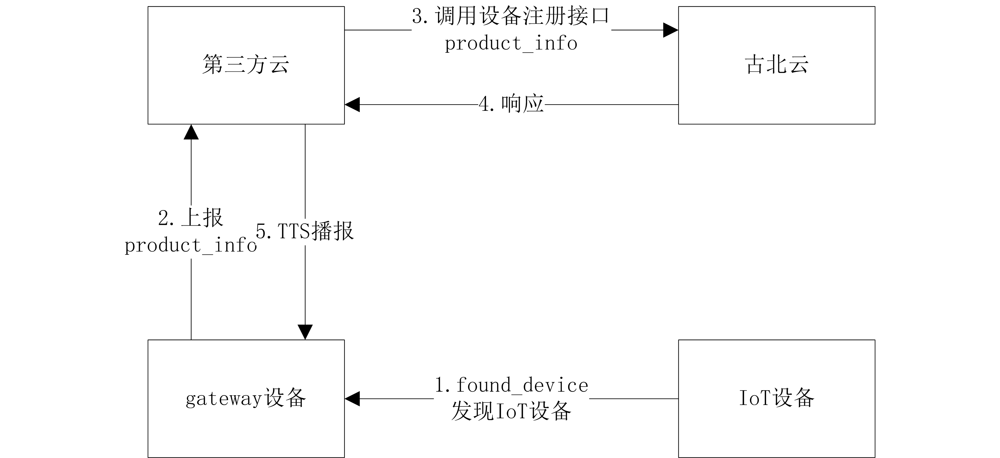
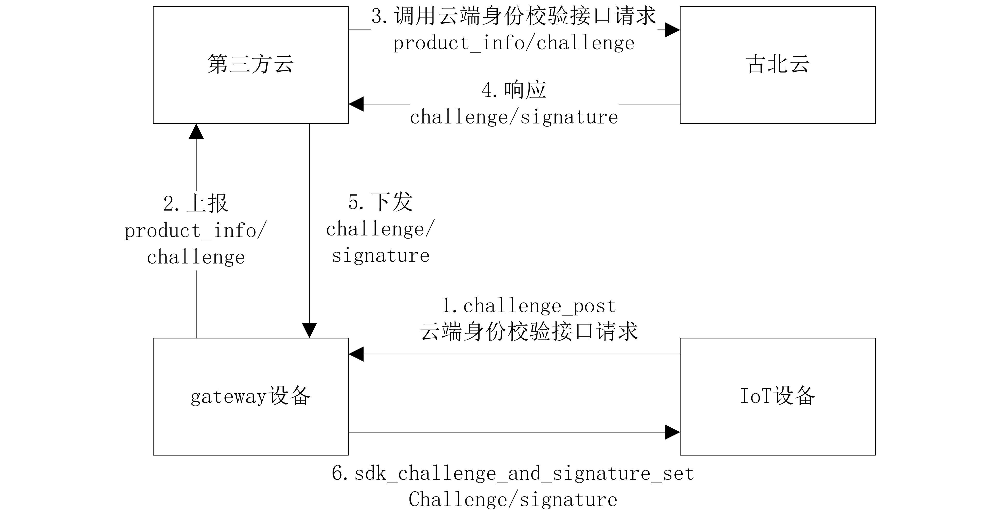
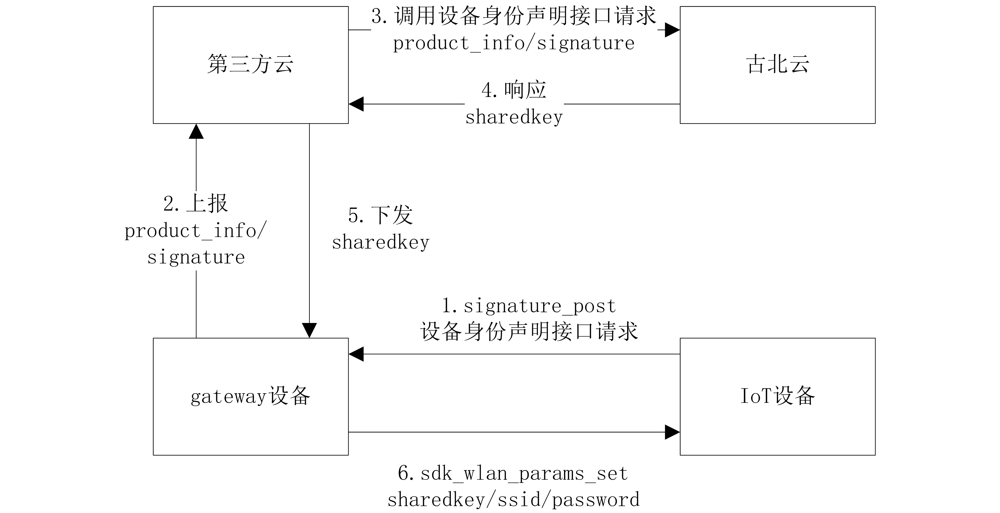

# 网关及网关云需要做的工作

<span style="color:#ccc">2.0</span> 网关需要开发内容
1. 升级WiFi驱动
   
    新的配网方式通过在网关和配件之间发送Probe requestWiFi管理报文方式将网关上的SSID和密码发送给配件.
    具体做法是使用Wi-Fi的custom Information Element字段携带厂商自定义数据格式.
    所以需要网关具备接收和发送管理报文的能力.

2. 集成配网SDK
    BroadLink已经将Probe Request报文的构建和解码封装成一个轻量级的SDK. 
    这个SDK不依赖第三方库,无线程和网络通信能力.所有,操作都需要网关主动触发.

<span style="color:#ccc">2.1</span> 网关云需要开发的内容
1. 和BroadLink云端接口进行互通
    
    具体参考云端接口列表.
2. 分配给BroadLink厂商VendorID

    通过这个ID,网关可以区分不同厂商的产品.

<span style="color:#ccc">2.2</span> 网关APP需要开发的内容
1. 集成BroadLink在线H5
2. 提供必要的JSBridge API和H5调用

具体参考H5集成指南.

<span style="color:#ccc">2.3</span> 网关平台需要提供的内容
1. 给BroadLink分配VendorID,用来区分BroadLink产品和其他产品

    具体参考配网SDK的接口.

<span style="color:#ccc">2.4</span> 网关SDK接口定义(Draft)

``` C
#ifndef __SDK_H
#define __SDK_H

/*
 * 0. implement all callback's of this SDK
 * 1. read wifi probe frame from driver
 * 2. feed wifi probe frame to sdk_pkt_process
 * 3. this sdk depends on no thirdparty libraries, and there is no internet connection with net.
 */


typedef     unsigned char               uint8;
typedef     unsigned short int          uint16;
typedef     unsigned int                uint32;

typedef     char                        int8;
typedef     short int                   int16;
typedef     int                         int32;

#define     SDK_SUCCESS                 (0)
#define     SDK_FAIL                    (1)
#define     SDK_NULL                    (0)
#define     OUI_LEN                     (3)
#define     OUI_TYPE                    (0)
#define     OUI_TYPE_LEN                (1)
#define     MAC_LEN                     (6)

#define     SDK_PACKED                  __attribute__((packed))


typedef void* (*sdk_memset_t) (
    void*       ptr,
    int32       value,
    uint32      num);
typedef void* (*sdk_memcpy_t) (
    void*       dst,
    const void* src,
    uint32      num);
typedef int32 (*sdk_memcmp_t) (
    const void* ptr1,
    const void* ptr2,
    uint32 num);
typedef int32 (*sdk_printf_t) (
    const char* format,
    ...);

typedef struct sdk_device_info_t {
	uint32      vendor_id;
    uint32      product_id;
    uint8       mac[MAC_LEN];
    uint8 *     device_info;
    uint16      device_info_len;
}sdk_product_info_t;

//发现设备
typedef int32 (*sdk_found_device_t) (sdk_product_info_t *product_info);
//对应2.1 云端身份校验接口请求
typedef int32 (*sdk_challenge_post_t)(
	sdk_product_info_t *product_info,
    uint8 *     challenge,
    uint16      challenge_len);
//对应2.2 设备身份声明接口请求
typedef int32 (*sdk_signature_post_t)(
	sdk_product_info_t *product_info,
    uint8 *     signature,
    uint16      signature_len);
//sdk将设备控制token传给上层
typedef int32 (*sdk_device_token_post_t)(
	sdk_product_info_t *product_info,
    uint8 *     token,
    uint16      token_len);
//上报配置结果
//目前只支持失败结果上报。
//成功的结果是由云端推送上线通知
//result 0:成功 -1:失败
typedef int32 (*sdk_config_result_post_t) (
	sdk_product_info_t *product_info,
    int8        result);
//发送802.11原始报文接口
typedef int32 (*sdk_raw_pkt_send_t)(
    uint8 *     frame,
    uint16      frame_len);

//aes加密函数
//CBC,128bit,PKCS5/PKCS7 padding
typedef int32 (*sdk_aes_encrypt_t)(
    uint8 * input,
    uint16 input_len,
    uint8 *output,
    uint8 *key,
    uint8 *iv);
typedef int32 (*sdk_aes_decrypt_t)(
    uint8 * input,
    uint16 input_len,
    uint8 *output,
    uint8 *key,
    uint8 *iv);


typedef struct {
    sdk_memset_t                      memset;
    sdk_memcpy_t                      memcpy;
    sdk_memcmp_t                      memcmp;
    sdk_printf_t                      printf;

    sdk_found_device_t                found_device;
    sdk_challenge_post_t              challenge_post;
    sdk_signature_post_t              signature_post;
    sdk_device_token_post_t           device_token_post;
    sdk_config_result_post_t          config_result_post;

    sdk_raw_pkt_send_t                send_raw_pkt;

    sdk_aes_decrypt_t                 aes_decrypt;
    sdk_aes_encrypt_t                 aes_encrypt;
} sdk_config_t;

typedef struct {

    //gateway信息
    //包括当前路由器信道，gateway mac，bssid
    uint8           channel;    //cur channel

	//若mac地址为00-11-22-33-44-55，则device_mac[] = {0x00,0x11,0x22,0x33,0x44,0x55};
    uint8           device_mac[MAC_LEN];
	//格式等同device_mac
    uint8           bssid[MAC_LEN];

    //802.11报文相关参数，OUI/OUI_TYPE需要协商
	//目前暂时先传入mac地址前三个字节为OUI
    uint8           oui[OUI_LEN];
    uint8           oui_type;

	//probe报文中ei type = 0需要填的ssid信息
	uint8			*ssid;
	uint8			ssid_len;

    //probe req和probe rsp报文选择，根据gateway 能力自行设置
    uint8           send_wlan_type; //0:probe_req 1:probe_rsp

    //考虑资源紧张的系统，在非配网时刻，可以复用此buffer
    uint8 *         buffer;
    // must >= 2k
    uint16          buffer_len;
    //call back function struct
    sdk_config_t    sdk_config;
} SDK_PACKED sdk_user_init_t;

typedef enum {
    SDK_STATE_PROBE_DEVICE,
    SDK_STATE_LOCK_CHANNEL,
    SDK_STATE_CONFIG,
    SDK_STATE_CONNECTING,
    SDK_STATE_DONE, //Finish
    SDK_STATE_FAIL,
} sdk_state_e;

/**
 * @brief	打印sdk编译时间
 * @return	0 打印成功
 * 			-SDK_E_INIT_FAIL sdk未初始化
 */
extern int32 sdk_version(void);
/**
 * @brief	初始化sdk
 * @param	init
 * @return 	0 初始化成功
 * 			-SDK_E_INIT_FAIL
 */
extern int32 sdk_init(sdk_user_init_t *init);
/**
 * @brief	处理接收的802.11报文
 * @param	frame	802.11标准报文格式
 * @param	frame_len
 * @return	sdk_state_e
 */
extern int32 sdk_pkt_process(uint8 *frame, int16 frame_len);
/**
 * @brief	发送token bind成功报文
 * @return	0 成功
 * 			-SDK_E_INIT_FAIL
 * 			-SDK_E_STATE
 */
extern int32 sdk_device_token_bind_success(void);
/**
 * @brief	ssid和passwd信息发送
 * @param	sharedkey	二进制数组，云端返回的是十六进制字符串，需要进行转换
 * @param	ssid
 * @param	ssid_len
 * @param	passwd
 * @param	passwd_len
 * @return	0 成功
 * 			-SDK_E_INIT_FAIL
 * 			-SDK_E_STATE
 * @example 路由器ssid为"ssid"，password为"passwd"
 * 			代码如下：
 * @code
 * uint8 ssid[] = "ssid";
 * uint8 passwd[] = "passwd";
 * sdk_wlan_params_set(sharedkey,ssid,strlen(ssid),passwd,strlen(passwd));
 * @endcode
 */
extern int32 sdk_wlan_params_set(uint8 sharedkey[32],uint8 *ssid,uint16 ssid_len,uint8 *passwd,uint16 passwd_len);
/**
 * @brief challenge和signature信息发送
 * @param challenge	二进制数组，云端返回的是十六进制字符串，需要进行转换
 * @param challenge_len
 * @param signature	二进制数组，云端返回的是十六进制字符串，需要进行转换
 * @param signature_len
 * @return	0 成功
 * 			-SDK_E_INIT_FAIL
 * 			-SDK_E_STATE
 */
extern int32 sdk_challenge_and_signature_set(uint8 *challenge,uint16 challenge_len, uint8 *signature, uint16 signature_len);
/**
 * @brief	用户确认开始配网
 * @return	0 成功
 * 			-SDK_E_INIT_FAIL
 * 			-SDK_E_STATE
 */
extern int32 sdk_user_auth_to_start_config(void);
/**
 * @brief	清除sdk状态
 * @return	0 成功
 * 			-SDK_E_INIT_FAIL
 */
extern int32 sdk_reset(void);

#endif
```

<span style="color:#ccc">2.5</span> 网关SDK接口调用流程图

<span style="color:#ccc">2.5.1</span> 发现设备



<span style="color:#ccc">2.5.2</span> 云端身份校验请求



<span style="color:#ccc">2.5.3</span> 设备身份申明请求



<span style="color:#ccc">2.5.4</span> token上报


